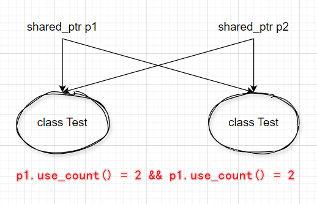

# C++ 语言基础

## 1. 介绍四种智能指针

- 为什么引入智能指针，智能指针是什么？

智能指针的作用是管理一个指针，避免指针指向的内存空间在函数结束时忘记释放，造成内存泄露问题。

智能指针实际上是一个类，在创建时会申请内存并初始化，当超出函数作用域时，会自动调用析构函数，释放内存空间。

所有智能指针的核心作用原理就是：在函数结束时，自动释放指针资源，不需要程序员手动释放。

分别为哪四种？

1. auto_ptr (c98使用) 采用所有权模式

```
auto_ptr<std::string> str1(new string("hello"));
auto_ptr<std::string> str2;
str2 = str1;
```

这种方式会在复制时，转移str1的全部所有权，这可能导致资源管理不当，出现内存泄露问题。

2. unique_ptr 独占指针

实现独占式拥有，在同一时间只能有一个 unique_ptr 指向该对象，对避免资源泄露管用。

```
unique_ptr<std::string> str1(new string("hello"));
unique_ptr<std::string> str2;
// str2 = str1; // 会直接报错
```

这会避免 str1 指向其他未知数据的风险。比 auto_ptr 更加安全。

3. shared_ptr 共享指针

允许多个共享指针指向同一个对象，该对象和相关资源会在最后一个共享指针被销毁时释放。内部使用引用计数机制来记录资源被多少指针占用。

```
shared_ptr<std::string> str3(new string ("world"));
```

当引用计数变为0时，释放资源。可使用 use_count() 查看引用计数个数。除了使用 new 来构造，还可以通过 unique_ptr或者weak_ptr来构造实现。

当我们调用 release()时，当前指针会释放资源所有权，引用计数-1。

```
unique_ptr<std::int> num1(new int(10));
shared_ptr<std::int> num2(num1);
```

4. weak_ptr 弱引用

主要是为了解决两个shared_ptr互相引用导致各自的引用计数无法变为0的问题，造成资源无法释放。解决办法为将其中一个变为 weak_ptr即可。

它只指向 shared_ptr管理的对象，对该对象进行内存管理的主要还是对应的 shared_ptr;

weak_ptr只提供了对管理对象的一个访问手段，设计目的也是为了配合 shared_ptr进行工作，通过另一个weak_ptr或者shared_ptr构造后，该对象的引用计数不会增加。

```c++
#include <memory>
#include <iostream>

class Test {
public:
    ~Test() {
        std::cout << "Test object destroyed" << std::endl;
    }
};

int main() {
    std::shared_ptr<Test> ptr1(new Test());
    std::weak_ptr<Test> ptr2; // ptr2 声明为 weak_ptr

    {
        std::shared_ptr<Test> ptr3 = ptr1;
        // ptr1 和 ptr3 互相引用，形成循环引用
        ptr1 = ptr3;
        // ptr2 现在持有 weak_ptr，不会导致循环引用问题
        ptr2 = ptr1;
        // 离开作用域后 ptr3会被删除
    }
    
    // ptr2 作为 weak_ptr，不会阻止对象的销毁
    std::cout << "ptr1 and ptr3 destroyed, checking if ptr2 is expired: " << std::boolalpha << ptr2.expired() << std::endl;

    // 尝试从 weak_ptr 获取 shared_ptr
    std::shared_ptr<Test> lockedPtr = ptr2.lock();
    // std::weak_ptr::lock() 函数的作用是尝试获取一个 std::shared_ptr，
    // 该 std::shared_ptr 与调用 lock() 的 std::weak_ptr 指向同一个对象。
    if (lockedPtr) {
        // 如果对象未被销毁，重新获得控制权
        std::cout << "Reacquired control of Test object" << std::endl;
    } else {
        std::cout << "Test object has been destroyed" << std::endl;
    }

    return 0;
}
```

运行结果：

> /> ptr1 and ptr3 destroyed, checking if ptr2 is expired: false
> /> Reacquired control of Test object
> /> Test object destroyed



## 2. C++ 中的内存分配情况

