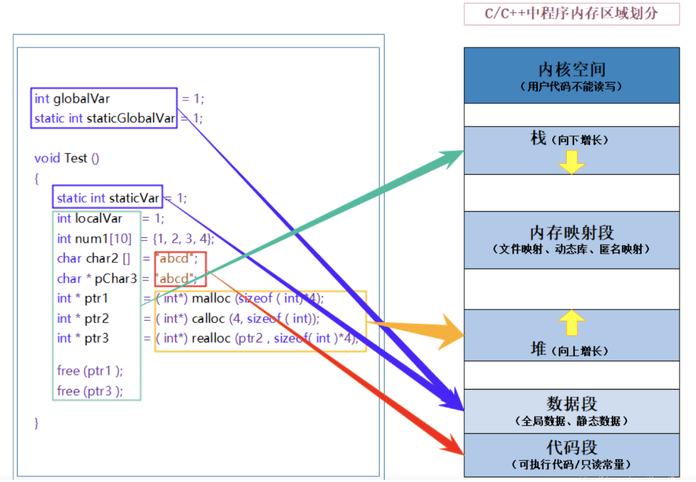

# C++ 语言基础

## 1. 介绍四种智能指针

- 为什么引入智能指针，智能指针是什么？

智能指针的作用是管理一个指针，避免指针指向的内存空间在函数结束时忘记释放，造成内存泄露问题。

智能指针实际上是一个类，在创建时会申请内存并初始化，当超出函数作用域时，会自动调用析构函数，释放内存空间。

所有智能指针的核心作用原理就是：在函数结束时，自动释放指针资源，不需要程序员手动释放。

分别为哪四种？

1. auto_ptr (c98使用) 采用所有权模式

```
auto_ptr<std::string> str1(new string("hello"));
auto_ptr<std::string> str2;
str2 = str1;
```

这种方式会在复制时，转移str1的全部所有权，这可能导致资源管理不当，出现内存泄露问题。

2. unique_ptr 独占指针

实现独占式拥有，在同一时间只能有一个 unique_ptr 指向该对象，对避免资源泄露管用。

```
unique_ptr<std::string> str1(new string("hello"));
unique_ptr<std::string> str2;
// str2 = str1; // 会直接报错
```

这会避免 str1 指向其他未知数据的风险。比 auto_ptr 更加安全。

3. shared_ptr 共享指针

允许多个共享指针指向同一个对象，该对象和相关资源会在最后一个共享指针被销毁时释放。内部使用引用计数机制来记录资源被多少指针占用。

```
shared_ptr<std::string> str3(new string ("world"));
```

当引用计数变为0时，释放资源。可使用 use_count() 查看引用计数个数。除了使用 new 来构造，还可以通过 unique_ptr或者weak_ptr来构造实现。

当我们调用 release()时，当前指针会释放资源所有权，引用计数-1。

```
unique_ptr<std::int> num1(new int(10));
shared_ptr<std::int> num2(num1);
```

4. weak_ptr 弱引用

主要是为了解决两个shared_ptr互相引用导致各自的引用计数无法变为0的问题，造成资源无法释放。解决办法为将其中一个变为 weak_ptr即可。

它只指向 shared_ptr管理的对象，对该对象进行内存管理的主要还是对应的 shared_ptr;

weak_ptr只提供了对管理对象的一个访问手段，设计目的也是为了配合 shared_ptr进行工作，通过另一个weak_ptr或者shared_ptr构造后，该对象的引用计数不会增加。

```c++
#include <memory>
#include <iostream>

class Test {
public:
    ~Test() {
        std::cout << "Test object destroyed" << std::endl;
    }
};

int main() {
    std::shared_ptr<Test> ptr1(new Test());
    std::weak_ptr<Test> ptr2; // ptr2 声明为 weak_ptr

    {
        std::shared_ptr<Test> ptr3 = ptr1;
        // ptr1 和 ptr3 互相引用，形成循环引用
        ptr1 = ptr3;
        // ptr2 现在持有 weak_ptr，不会导致循环引用问题
        ptr2 = ptr1;
        // 离开作用域后 ptr3会被删除
    }
    
    // ptr2 作为 weak_ptr，不会阻止对象的销毁
    std::cout << "ptr1 and ptr3 destroyed, checking if ptr2 is expired: " << std::boolalpha << ptr2.expired() << std::endl;

    // 尝试从 weak_ptr 获取 shared_ptr
    std::shared_ptr<Test> lockedPtr = ptr2.lock();
    // std::weak_ptr::lock() 函数的作用是尝试获取一个 std::shared_ptr，
    // 该 std::shared_ptr 与调用 lock() 的 std::weak_ptr 指向同一个对象。
    if (lockedPtr) {
        // 如果对象未被销毁，重新获得控制权
        std::cout << "Reacquired control of Test object" << std::endl;
    } else {
        std::cout << "Test object has been destroyed" << std::endl;
    }

    return 0;
}
```

运行结果：

> /> ptr1 and ptr3 destroyed, checking if ptr2 is expired: false
> /> Reacquired control of Test object
> /> Test object destroyed


## 2. C++ 中的内存分配情况



- 栈：由编译器负责管理，存储函数参数和局部变量。
- 堆：由程序员申请和释放，使用new和delete操作管理。
- 数据段：也称为全局、静态存储区，存放全局变量和静态变量，分为初始化部分和未初始化部分。
- 代码段：存放程序的二进制代码，使得CPU不用一直从硬盘读取程序。

## 3. C++ 中的指针参数传递和引用参数传递

- 指针参数传递：实际上还是值传递，通过指针的方式传入进来的实参的地址值。传入后形参会作为局部变量处理，同时在栈内申请内存空间，存放传入变量的副本，实际上是复制了一份数据再存储供函数体内部使用。

	这种方式的特点是：调用函数对传入变量的修改都是在对栈中存放的副本数据进行修改，并不会影响实参的值。

- 引用参数传递：同样也是在栈中开辟内存空间，但此时存放的是实参的地址，函数体内部对于该变量的修改都会实际影响到是实参的值。

	被调函数对形参的任何操作都看做是间接寻址，通过栈内存放的地址值再找到实参。引用的方式有助于节省内存，尤其是传入的对象是类等数据结构。

从编译的角度来讲，在编译阶段，分别将指针和引用存储到符号表中，符号表记录的是变量名以及变量所在地址。

指针变量在符号表中记录的是指针变量自身的地址值；而引用在符号表中记录的是引用对象的地址值（与实参名字不同，但地址相同）。

符号表生成后就不会再修改，因此指针可以改变指向的对象，而引用对象不能进行修改。

## 4. C++ 中const和static关键字

1. static ： 控制变量的存储方式和可见性

- 修饰局部变量：在函数体内部的变量加上static修饰后，会将变量存储区域从栈区变为静态存储区，原来变量在函数体结束后就会释放，修饰后将生命周期延长至整个程序运行周期。但注意的是其作用域不会改变，仍为函数体内部。

- 修饰全局变量：修改变量的作用域，从整个工程可见变为了仅本文件可见。如果没有加static修饰，在其他文件中包含头文件即可使用该全局变量。
- 修饰函数：与修饰全局变量类似，也是修改函数作用域。
- 修饰类内成员或变量：如果修饰类内函数，说明该函数属于类，而不属于此类的任何特定对象。如果对类内变量加static修饰，则表明该变量在内存空间中仅有一个副本，不属于任何对象或实例，可供类和对象调用。静态成员函数不接受this指针，因此不能访问非静态成员函数。

2. const 关键字

- 修饰基本数据类型：表示该类型为只读，不可以进行修改。

- 修饰指针变量和引用变量：

- 修饰函数传入参数：通常使用const& 的方式来保护传入参数变量不被修改，防止传入后实参被调用函数内部错误修改。

- 在类中修饰成员变量：表示在类的实例生命对象期间不可修改。const 数据成员的初始化只能在类的构造函数初始化列表中实现。

- 在类中修饰成员函数：防止成员函数修改对象的内容。在函数内部只读不可修改。

- 修饰类对象：定义常量对象，只能调用常量函数。

	- ```c++
		class MyClass {
		public:
		    MyClass(int val) : value(val) {}
		
		    // 非 const 成员函数，可以修改对象状态
		    void NonConstFunc() {
		        value++;
		    }
		    // const 成员函数，保证不修改对象状态
		    void ConstFunc() const {
		        // value++; // 错误：不能修改 const 对象的状态
		    }
		    int GetValue() const {
		        return value;
		    }
		
		private:
		    int value;
		};
		
		int main() {
		    const MyClass constObj(10); // 定义了一个 const 对象
		    constObj.ConstFunc(); // 正确：可以调用 const 成员函数
		    // constObj.NonConstFunc(); // 错误：不能调用非 const 成员函数
		    return 0;
		}
		```

## 5. C和C++区别

1. C和C++在基本语句上区别不大。
2. C++中新增了部分语法和关键字：语法方面有头文件的不同和命名空间的不同，C++中可以定义自己的空间，C中没有。关键字方面，C++中使用new和delete申请内存空间，而且C++在指针的基础上新增了引用的概念。
3. C++中有重载和虚函数的概念。C++支持函数重载主要是因为编译器在编译时能够根据参数的类型和数量来区分不同的函数调用，而C语言不支持函数重载，因为它的函数调用匹配仅基于函数名。C++还支持虚函数，用以实现多态。
4. C++中的类class和C中的struct也有不同。C中的struct可以看做是数据结构的实现，而C++中的类class适合看做对象的实现体，不仅可以有成员变量，也可包含成员函数，新增了访问权限的控制。struct的默认访问控制权限都是public，而class默认为private。
5. C++中新增了模板，可以重用代码，提供了更加强大的STL标准库。

## 6. C++和Java的区别

1. 一个很重要的区别是Java中存在自动内存管理机制，Java程序中所有对象都是new操作符建立在堆上的，Java会自动为回收变量打上标签，利用线程在空余时间回收废弃变量占用的内存资源，保证内存高效管理和预防内存泄露。而C++中必须由程序员手动申请和释放内存，存在内存泄露的风险。
2. Java中不提供指针操作，无法直接访问内存，有效避免了指针操作失误带来的安全隐患。但并非Java中没有指针，只是没有使用权限。
3. Java是完全面向对象设计的语言，所有的函数和变量必须是类的一部分。对象将数据和方法封装起来，便于使用和管理。C++中类可以实现多重继承，但Java不可以，它支持一个类继承多个接口，也实现类似于多重继承的效果。(后续简单了解一下Java内存管理机制)
4. C++中对代码有预处理步骤，实现对宏定义、头文件、条件编译等处理。而Java中没有此步骤，它提供的import有类似功能。

## 7. C++ 如何定义常量，存储在何种地方（有待优化）

1. 使用const关键字：定义变量为只读属性，也即常量，无法修改。全局常量存放在内存数据段区。
2. 使用constexpr关键字：用于定义编译时常量，其值在编译时即可确定，后来也支持定义常量表达式。
3. 使用宏定义：通过define指令，实际上这种方式定义的并非常量，而是在编译阶段的文本替换工具
4. 枚举是C++中定义一段相关变量的常用方法。通常存储在数据段中。

## 8. C++中重载、重写和重定义的区别

1. 重载（overload)指同一可访问区中具有不同参数列表的同名函数。根据参数列表选择调用的类型，不关心函数的返回值类型。
2. 重写：派生类中重新定义父类中除函数体外完全相同的虚函数，重写和被重写的函数应该在不同类中，重写函数的访问修饰符可以更改，比如父类中是public，但派生类可改为private。
3. 重定义：派生类重新定义父类中相同名字的非virtual函数，可以有不同的参数列表和返回值。

## 9. 介绍C++所有的构造函数

当类创建对象时，编译系统自动为对象分配内存空间，并调用构造函数，初始化成员变量。

1. 默认构造函数

如果没有写出无参构造函数，编译器会自动生成默认构造函数，但什么也不做。

2. 一般构造函数

可以有多个不同参数列表的构造函数，创建对象时根据传入参数类型选择不同的构造函数来初始化对象。

3. 拷贝构造函数

此函数的参数为对象本身的应用，即const& op，根据一个已知的对象来赋值该类的一个新对象，并将该对象的所有数据成员值进行复制。如果用户没有自定义，则编译器自动生成。

4. 赋值运算符重载

类似于拷贝构造函数，将=右边对象的值复制给=左边对象，这里的两个对象必须是都已经创建好的。

```
A a1, A a2; a1 = a2;//调用赋值运算符
A a3 = a1;//调用拷⻉构造函数，因为进行的是初始化工作，a3 并未存在
```

## 10. 四种强制类型转换

四种类型转换包括：static_cast, dynamic_cast, const_cast, reinterpret_cast

1. static_cast：限制最少，主要用于内置数据类型之间的转换。例如将int类型转换为float型。或者将一个类层次结构中的派生类指针转换为基类指针，反之不安全。
2. dynamic_cast:主要用于处理多态性，允许安全的下行转换，即将基类指针或引用转换为派生类指针或引用，它在运行时执行类型检查，如果转换失败返回nullptr。它只能用于具有继承关系的类之间，且基类包含虚函数。
3. const_cast：用于移除变量的const或者volatile修饰符，这种方式不改变变量的值类型，只改变类型修饰符。
4. reinterpret_cast：允许几乎任意的指针或引用之间的转换，用于低级别的非安全转换。

示例：

```
// static_cast 将int转换为float
int i - 10；
float fi = static_cast<float>(i);

// dynamic_cast 将基类指针转换为派生类指针（爸爸变为儿子）
preson* p1 = new student();
student* s1 = dynamic_cast<student*>(p1);

// const_cast 移除变量的const修饰属性
const int* p1 = new int(10);
int* p2 = const_cast<int*>(p1);

// reinterpret_cast 任意非安全的类型转换
int* p = new int(1);
char* c = reinterpert_cast<char*>(p);
```

## 11. 指针和引用的区别

1. 指针是一个实体，而引用是别名。
2. 在程序编译时，将指针和引用添加到符号表中。指针指向实际内存，指针存放的是所指内存的地址。编译时符号表存放 指针变量名-指针变量的地址。指针的指向是可以改变的，只需要修改指针变量中存放的地址即可。引用是变量别名，添加到符号表中是按照 引用变量名-引用指向的对象地址。由于符号表生成后不能修改，因此引用经过初始化后不能改变。
3. sizeof指针得到的是指针的大小，而sizeof引用得到的是引用指向对象的大小。
4. 作为参数传递时，传指针会生成变量副本，而传引用则是直接对传入实参进行修改。

## 12. 野指针和悬空指针的区别

野指针是指没有被初始化过的指针。悬空指针是最初指向的内存已经被释放的指针。

这两种指针都会指向无效内存区域，操作会导致不可预料的结果发生。

## 13. const 修饰指针如何区别

```
const int* p1; // 可以想象int* p1加括号，整体代表指针指向的值，也就是 指针指向的变量值无法修改。
int* const p2; // 指针指向的变量不可修改，也就是p1只能指向一个变量。
```

## 14. 函数指针

函数指针是指向函数的指针变量，与指针指向整型变量是类似的。

函数指针首先是一个指针变量，然后再指向一个具体函数。

```
// 定义函数指针
char* (*pf) (char* p)
// 函数fun
char* fun(char* p) {}
// 指向函数
pf = fun;
pf(p);
```

在编译时，每个函数都有一个入口地址，该入口地址就是函数指针所指向的地址。

## 15. 堆和栈的区别

栈：由编译器进行管理，在需要自动分配空间，调用结束后自动回收，主要用于保存函数局部变量、和函数参数等。栈是连续的内存空间，由高地址向低地址扩展

堆：有程序猿手动申请和释放，使用new和delete关键字。在内存中是不连续的，在系统中有空闲链表，申请内存时，系统遍历空闲链表找到第一块符合大小要求的内存区域。如果内存有剩余，也会插入到空闲链表中。堆是由低地址向高地址扩展，较为灵活。

## 16. 函数参数传递方式

值传递：形参是实参的拷贝，函数内部在栈中存放形参变量，内部修改形参不会影响到实参。

指针传递：实际上为值传递的一种，形参是指向实参地址的指针。

引用传递：将引用对象的地址存放在形参，也就是函数栈中，函数对形参的修改可以直接映射到外部实参。

## 17. new 和 delete 、malloc 和 free 的区别

